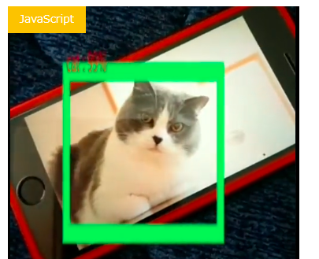
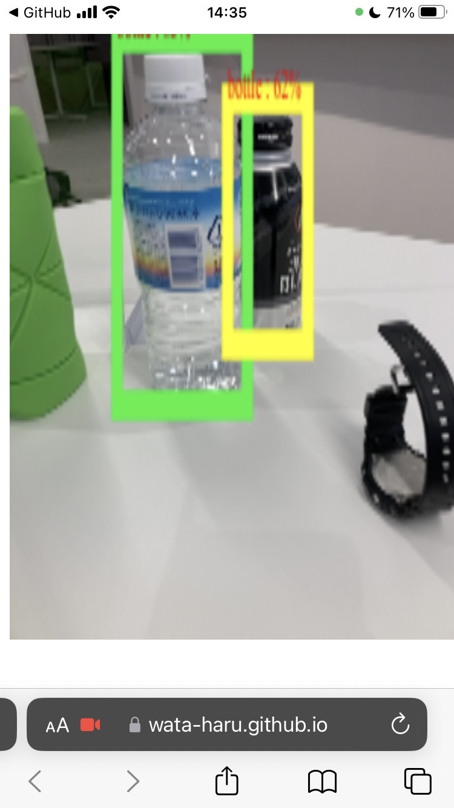
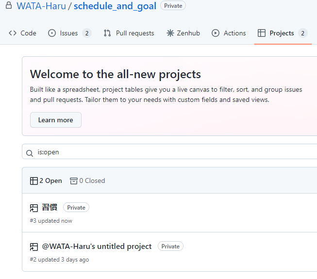
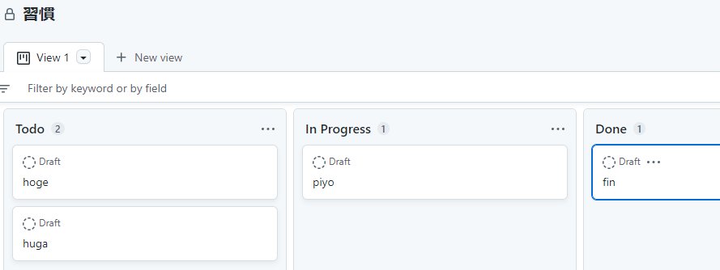

<!--

スライドのルールを、
1. まずレイアウトから考えて、使いやすい区切りで区切る
2. 読み手の視点はZで読むというのを意識した配置
3. ベースは白、文字は濃いグレー、メインカラーは濃紺か、少し薄めの青、アクセントは補色のオレンジもしくは黄色を薄めたやつ

-->
<!-- _class: title -->
# 1222_もくもくLT
<!--## サブタイトル-->
---

# もくじ
## Marp使ってみた
## tensorflow.js
## githubで自分を管理したい

---
<!-- header: 1222LT/Marp使ってみた -->
# h1 Marp
## h2 こんな感じで見出しを設定して
- footerもイかした感じにして
- pasteimage(プラグイン)も入れてコピペできるようにして
- ページ番号もふれました
  

```c
#include <stdio.h>
int main(){
    printf("Hello,World!\n");
    return 0;
}

```

---
# 課題
## 直書きCSSが...使えない!?
- <span style="color:#ffd700; ">hoge</span>
<span style="color:red;">word</span>
これは<span style="color: red; ">赤文字</span>です

# 解決できそう
「Marpのカスタマイズテーマで、ワークショップ用のスライドをいい感じにつくれました」
https://qiita.com/hann-solo/items/efb772fdb6f7cb9ca6e2

---
# 参考文献
1. （備忘録）Marpテンプレート(https://qiita.com/zono_0/items/e6ab64f381440578ea1c)->ほぼこれのパクリ
2. 【Visualstudio Code+Markdown】 1から作るMarpの会社用スライドTheme実装【not先頭ページ編(https://manuhater.com/entry/marp-custom)
3. Marpで会社用スライドを作成(https://iroiroyaru.netlify.app/2021-05-14_marp/)
4. Marpit(https://qiita.com/takeshisakuma/items/5a61e6eac123d28602fb)->チートシート
---
5. 配色は難しくない！
キレイなプレゼン資料の配色ルール(https://ppt-lab.presentationdesign.jp/cat_visual/515/)
->美しい+伝わるスライドの作り方
6. パワーポイントは第一印象! 差をつける2つのポイント(https://style.nikkei.com/article/DGXZQOLM045CE0U2A100C2000000/?page=3)

---
<!--header: 1222LT/tensorflow.js-->
# tensorflow.js
スマホカメラで読み取りしたい

Tensorflow.jsとスマホのカメラで、リアルタイム物体検出(https://www.code-mogu.com/2021/09/16/tensorflow-smartphone-camera/)

---
# コード全部ぱくって読み取った結果

---

---


---

<!--header: 1222LT/githubで自分を管理したい-->
# githubで自分で管理したい

# 
# 
# なにいってんだこいつ？？？

---


---
# github project

github projectで計画管理
https://qiita.com/okazuki/items/5a50ef367ad9659fc574

---
# 冬はバキバキにgithub-projectで計画管理します~~あわよくば草はやします~~)
